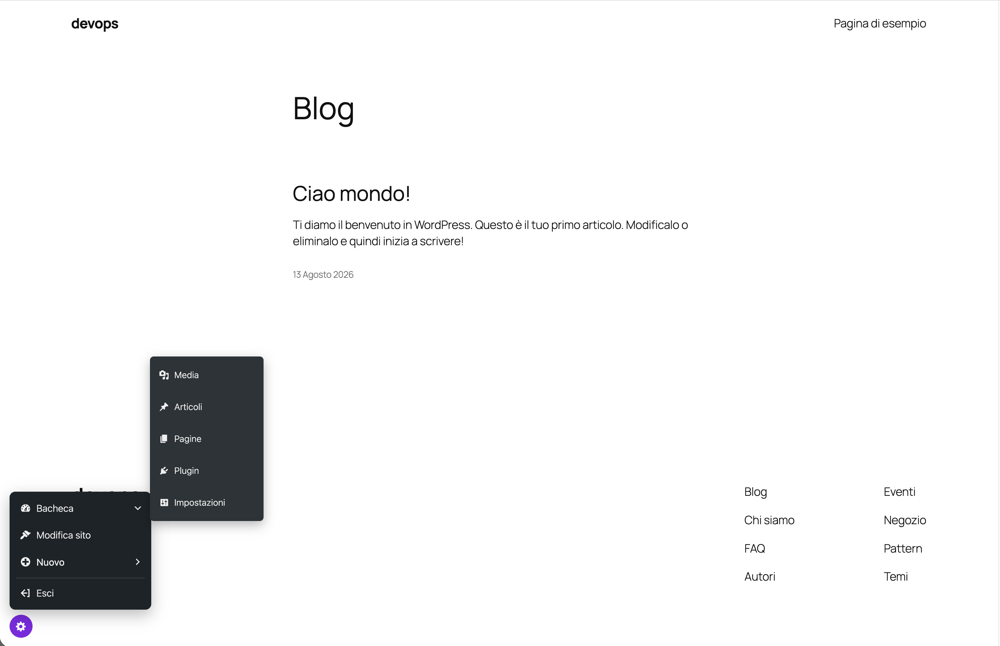
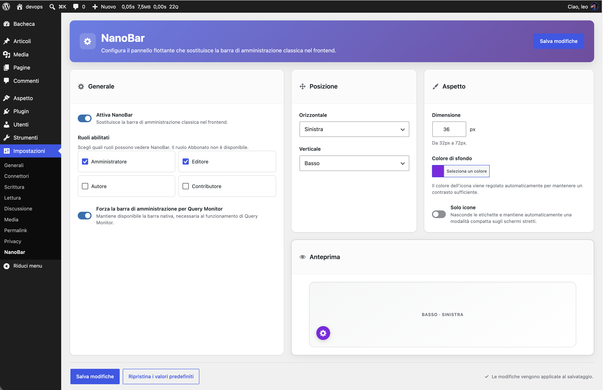

# NanoBar

**NanoBar** is a WordPress plugin that replaces the classic admin bar on the frontend with a compact, role-aware floating panel. Configuration lives in a single global settings page: **Settings → NanoBar**.



## Features

- **Floating toggle button** — a small circular button, positioned in a corner of the viewport, that opens a compact quick-access menu.
- **Role-aware** — choose which roles (all except Subscriber) see NanoBar on the frontend.
- **Configurable position** — left, center, or right, on the top or bottom edge (center is only available on the bottom edge).
- **Configurable appearance** — toggle size (32–72px) and background color, with the icon color automatically adjusted for contrast.
- **Icons-only mode** — hides labels for a more compact panel (manual setting).
- **Automatic phone tab bar** — on narrow screens (≤600px) the floating toggle is replaced by an always-visible bottom tab bar (icon + label per item), instead of squeezing the dropdown menu into icon-only rows.
- **Context-aware "Edit" link** — links straight to editing whatever is currently being viewed: a post/page, a taxonomy term, an author archive, a date archive, or a post type archive.
- **Site Editor deep link** — on block themes, opens the Site Editor directly on the block template that is rendering the current page; on classic themes, links to Appearance → Themes.
- **Quick "New" menu** — create a new post, page, media item, or any public custom post type the current user can create.
- **Dashboard submenu** — quick links to Media, Posts, Pages, Plugins, Settings (and Contact, if Contact Form 7 is active), shown to administrators.
- **Query Monitor support** — keeps Query Monitor's toggle working even with the native admin bar hidden.
- **Log out** — always available, redirecting back to the current page by default.
- **Translation-ready** — ships with an Italian (`it_IT`) translation; see [Translations](#translations).

## Requirements

- WordPress 6.8, tested up to 7.1
- PHP 8.0+

## Installation

1. Install it from the WordPress admin (**Plugins → Add New**, search "NanoBar"), or copy (or clone) this repository into `wp-content/plugins/nanobar/`. No build step is required: the plugin has no runtime dependencies and ships its own lightweight autoloader.
2. Activate **NanoBar Compact Admin Toolbar** from the Plugins screen.
3. Go to **Settings → NanoBar** to configure it.

## Configuration

Go to **Settings → NanoBar** to configure:

- Enable/disable NanoBar and choose which roles can see it.
- Whether the native admin bar should be kept available for Query Monitor.
- Horizontal/vertical position, with a live preview.
- Toggle size and background color.
- Icons-only mode.



## Filters

- `nanobar_options` — filter the resolved options array (e.g. `add_filter( 'nanobar_options', function ( $options ) { ... } )`).
- `nanobar_logout_redirect` — filter the URL the user is sent to after logging out from NanoBar (defaults to the current page).

## Development

Install the dev toolchain (coding standards, static analysis, Node dependencies — the plugin itself has no runtime dependencies):

```bash
composer install
npm install
```

### Architecture

- `nanobar.php` — plugin header and bootstrap only; registers a small PSR-4-style autoloader for the `NanoBar\` namespace (no Composer/vendor dependency at runtime) and boots `NanoBar\Plugin`.
- `src/` — autoloaded classes under the `NanoBar\` namespace (`NanoBar\Settings\*`, `NanoBar\Frontend\*`, `NanoBar\Support\*`).
- `assets/scss/` — source stylesheets, organized by BEM block, compiled to `assets/css/`.
- `assets/js/` — frontend and admin-settings scripts.
- `languages/` — the `nanobar.pot` source catalog and per-locale `.po`/`.mo` translations.

### Building assets

SCSS is compiled with [Dart Sass](https://sass-lang.com/dart-sass/):

```bash
npm run build   # one-off compile of assets/css/frontend.css and assets/css/admin.css
npm run watch   # recompile on change, while working on the styles
```

### Coding standards

PHP code follows [WordPress Coding Standards](https://github.com/WordPress/WordPress-Coding-Standards), enforced with PHP_CodeSniffer:

```bash
composer run phpcs   # report violations
composer run phpcbf  # auto-fix what can be fixed
```

### Static analysis

[PHPStan](https://phpstan.org/), with WordPress stubs, is used for static analysis:

```bash
composer run phpstan
```

### Translations

String extraction and translation files live in `languages/`:

- `nanobar.pot` — the source catalog of every translatable string in the plugin.
- `nanobar-it_IT.po` / `nanobar-it_IT.mo` — the Italian translation (compiled `.mo` is what WordPress actually loads at runtime).

To add another locale, copy `nanobar.pot` to `languages/nanobar-{locale}.po`, translate it (e.g. with [Poedit](https://poedit.net/)), and save — Poedit compiles the matching `.mo` automatically.

### Building a release

`bin/build-zip.sh` packages a production-ready plugin ZIP: it lints with PHPCS, compiles the SCSS assets, then copies only the files WordPress actually needs (no `vendor/`, `node_modules/`, `composer.json`/`.lock`, dev configs, or this `README.md` — WordPress.org's own `readme.txt` is what ships instead) into a clean `nanobar/` folder and zips it.

```bash
bash bin/build-zip.sh                          # lint + build assets + package
bash bin/build-zip.sh --skip-npm                # reuse the already-compiled assets/css/*.css, skip `npm run build`
bash bin/build-zip.sh --skip-lint                # skip the PHPCS check
bash bin/build-zip.sh --skip-npm --skip-lint     # just re-package, skip both
```

The version number is read straight from the `Version:` header in `nanobar.php`. The resulting archive is written to `dist/nanobar-{version}.zip` (gitignored) — that's the ZIP to upload for a WordPress.org review, or to unpack into the SVN `trunk/` for a release.
