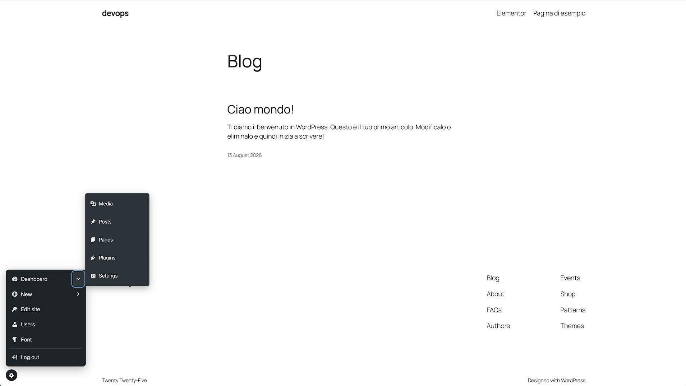
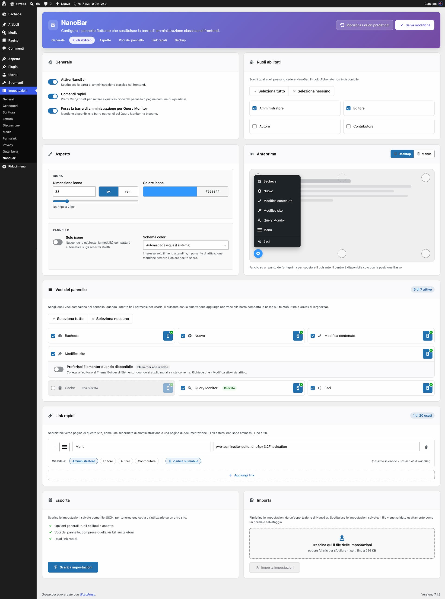

# NanoBar

**NanoBar** is a WordPress plugin that replaces the classic admin bar on the frontend with a compact, role-aware floating panel. Configuration lives in a single global settings page: **Settings → NanoBar**.



## Features

- **Floating toggle button** — a small circular button, positioned in a corner of the viewport, that opens a compact quick-access menu.
- **Role-aware** — choose which roles (all except Subscriber) see NanoBar on the frontend.
- **Configurable position** — left, center, or right, on the top or bottom edge (center is only available on the bottom edge).
- **Configurable appearance** — toggle size (32–72px, or 2–4.5rem) and background color (with quick swatches), with the icon color automatically adjusted for contrast.
- **Per-item phone visibility** — choose which panel items also appear in the compact bottom bar on phones (≤580px), for the built-in items and for each quick link.
- **Icons-only mode** — hides labels for a more compact panel (manual setting).
- **Automatic phone tab bar** — on narrow screens (≤580px) the floating toggle is replaced by an always-visible bottom tab bar (icon + label per item), instead of squeezing the dropdown menu into icon-only rows.
- **Context-aware "Edit" link** — links straight to editing whatever is currently being viewed: a post/page, a taxonomy term, an author archive, a date archive, or a post type archive.
- **Site Editor deep link** — on block themes, opens the Site Editor directly on the block template that is rendering the current page; on classic themes, links to Appearance → Themes. If Elementor is active and applies to the current view, links into Elementor instead (see [Elementor integration](#elementor-integration)).
- **Quick "New" menu** — create a new post, page, media item, or any public custom post type the current user can create.
- **Cache plugin management** — one-click "Clear cache" for whichever supported cache plugin is active, plus a submenu with its settings, "Clear all cache" and, where available, "Clear cache for the current page", shown to administrators (see [Cache plugin integration](#cache-plugin-integration)).
- **Configurable menu items** — choose which top-level items (Dashboard, Edit content, Edit site, New, Cache, Query Monitor, Log out) appear in the panel, from the settings page.
- **Dashboard submenu** — quick links to Media, Posts, Pages, Plugins, Settings (and Contact, if Contact Form 7 is active), shown to administrators.
- **Query Monitor support** — keeps Query Monitor's toggle working even with the native admin bar hidden.
- **Log out** — always available, redirecting back to the current page by default.
- **Keyboard navigation** — Arrow keys, Home/End, Right/Left (submenus) and Escape work inside the open panel; motion is disabled with `prefers-reduced-motion`.
- **Settings backup** — export the saved settings as JSON and import them back (or on another site) from Settings → NanoBar → Backup; imports go through the same sanitizer as a normal save.
- **Translation-ready** — ships with an Italian (`it_IT`) translation; see [Translations](#translations).

## Requirements

- WordPress 6.8, tested up to 7.1
- PHP 8.0+

## Installation

1. Install it from the WordPress admin (**Plugins → Add New**, search "NanoBar"), or copy (or clone) this repository into `wp-content/plugins/nanobar/`. No build step is required: the plugin has no runtime dependencies and ships its own lightweight autoloader.
2. Activate **NanoBar Compact Admin Toolbar** from the Plugins screen.
3. Go to **Settings → NanoBar** to configure it.

## Configuration

Go to **Settings → NanoBar** to configure:

- Enable/disable NanoBar and choose which roles can see it.
- Whether the native admin bar should be kept available for Query Monitor.
- Position (picked on the preview) and a live preview of the toggle, the open panel and the phone bar.
- Toggle size and background color.
- Icons-only mode.
- Which top-level items are visible in the panel, and whether Elementor is preferred over the Site Editor when it applies (see [Elementor integration](#elementor-integration)).



## Elementor integration

When [Elementor](https://elementor.com/) is active and **Prefer Elementor when available** is checked in the settings page, the "Edit site" item is replaced with a direct link into Elementor whenever Elementor actually applies to the current view:

- If the page/post being viewed was built with Elementor's own editor, it links straight to editing that content with Elementor.
- Otherwise, if [Elementor Pro](https://elementor.com/pro/)'s Theme Builder is controlling part of the current template (a header, footer, single, or archive template), it links to the Theme Builder screen.
- If neither applies — including when Elementor isn't active — the usual Site Editor (block themes) or Appearance → Themes (classic themes) link is used instead.

The Elementor Pro Theme Builder check reaches into Elementor Pro's internal (non-public) API and is guarded to fail closed if that API isn't there, but it hasn't been exercised against a real Elementor Pro install — worth double-checking after upgrading Elementor Pro.

The same setting also controls the "New" submenu: Elementor registers its own public post types for saved content (Templates, Floating Elements, Elementor Pro's landing pages) that would otherwise show up there like any other custom post type. While **Prefer Elementor when available** is off, those are left out of the list — see `nanobar_elementor_post_types` under [Filters](#filters) to add or correct entries.

## Cache plugin integration

When a supported cache plugin is active, administrators get a "Cache" item in the panel: clicking it runs whichever purge scope the plugin actually exposes on its frontend admin bar (the whole site's cache if available, otherwise just the current page's), and its submenu offers the plugin's own settings screen plus "Clear all cache"/"Clear cache for the current page" individually, for whichever of those two the plugin supports. Every action works by proxying a click to a button the cache plugin itself already added to the native admin bar (the same technique used for the Query Monitor item), so it inherits that plugin's own security/nonce handling instead of NanoBar reimplementing it.

Built-in, best-effort support: WP Rocket, W3 Total Cache, WP Super Cache, LiteSpeed Cache, WP Fastest Cache, FastCache (host.it) — LiteSpeed Cache, WP Fastest Cache, WP Super Cache and FastCache have actually been verified against a live install:

- **LiteSpeed Cache**: its top-level admin bar item turned out to only link to its settings page; the real "clear all"/"clear this page" actions live on two of its child nodes instead — a good reminder that a plugin's top-level admin bar node is not necessarily itself a working purge link.
- **WP Fastest Cache**: same shape as LiteSpeed Cache (top-level node links to settings, purge actions are child nodes) — both "Clear all cache" and "Clear cache for the current page" confirmed working end to end (a real click fires its `wpfc_delete_cache`/`wpfc_delete_current_page_cache` AJAX action).
- **WP Super Cache**: only exposes a "clear this page" node on its frontend admin bar — its site-wide purge node only exists in the admin-only variant of its toolbar, which the frontend never renders. So the panel's "Cache" item only ever offers "Clear cache for the current page" for it, never "Clear all cache". Confirmed working end to end (a real click completes the full round trip through `wp-admin` and back that this plugin's own link performs).
- **FastCache**: gets a "Cache" item linking to its settings screen only, with no purge button. Its admin bar "CDN Purge" nodes only exist once its separate CDN feature is enabled (not the local page cache it otherwise runs), and even then its own JS looks to have a bug that would stop the frontend ones from working (the markup and the click handler's selector don't match) — nothing there for NanoBar to reliably hook into today.

Double-check the detection, admin bar node ids, and settings URL for whichever plugin a site actually uses; a wrong node id just makes that button quietly hide itself (see `frontend.js`), so there's no harm in a guess turning out wrong — worth confirming all the same before relying on it. Add, remove, or correct an entry with the `nanobar_cache_plugins` filter instead of patching the plugin:

```php
add_filter( 'nanobar_cache_plugins', function ( array $registry ) {
	$registry[] = array(
		'id'                 => 'my_cache_plugin',
		'label'              => 'My Cache Plugin',
		'is_active'          => fn () => defined( 'MY_CACHE_PLUGIN_VERSION' ),
		'purge_all_node_id'  => 'my-cache-plugin',          // admin bar node id that clears the whole cache, i.e. #wp-admin-bar-{purge_all_node_id}; null if the plugin has no working purge node (the item then just links to settings_url).
		'purge_page_node_id' => 'my-cache-plugin-purge-url', // same, for the current page/URL only; null if there isn't one.
		'settings_url'       => admin_url( 'admin.php?page=my-cache-plugin' ),
	);
	return $registry;
} );
```

If two cache plugins are active at once, the first match in the registry wins (running two full-page cache plugins together is a known source of conflicts anyway, so this shouldn't come up in practice).

## Filters

- `nanobar_options` — filter the resolved options array (e.g. `add_filter( 'nanobar_options', function ( $options ) { ... } )`).
- `nanobar_logout_redirect` — filter the URL the user is sent to after logging out from NanoBar (defaults to the current page).
- `nanobar_cache_plugins` — filter the registry of cache plugins the panel's "Cache" item can detect; see [Cache plugin integration](#cache-plugin-integration).
- `nanobar_elementor_post_types` — filter the list of post type slugs treated as Elementor's own (`elementor_library`, `e-floating-buttons`, `e-landing-page` by default), hidden from the "New" submenu whenever "Prefer Elementor when available" is off.
- `nanobar_command_palette_items` — filter the registry of extra command palette destinations (profile, comments, users, themes, tools by default). Each entry needs `label`, `url`, `icon`, and `is_visible` (a callable returning bool, evaluated per request):

```php
add_filter( 'nanobar_command_palette_items', function ( array $registry ) {
	$registry[] = array(
		'label'      => 'My Custom Tool',
		'url'        => admin_url( 'admin.php?page=my-custom-tool' ),
		'icon'       => 'dashicons-admin-generic',
		'is_visible' => fn () => current_user_can( 'manage_options' ),
	);
	return $registry;
} );
```

## Settings page TODO

UX/UI improvements identified in a review of Settings → NanoBar (code review plus a live pass in the browser). Done items are ticked; the rest are still open.

### High priority

- [x] **Richer preview**: shows the open panel (selected items, quick links, icons-only, color scheme) with a desktop / mobile (≤580px bottom bar) switch.
- [x] **Labelled header actions**: text "Save changes" / "Restore defaults" (icon only once the header is stuck or on narrow screens). Restore was *not* moved into a secondary menu.
- [x] **Replace `window.confirm()`** for "Restore defaults" with an inline confirmation and an undo toast.
- [x] **Single Save button**: the footer duplicate is gone (the sticky header has it, plus an "Unsaved changes" label).
- [x] **AJAX save** (`fetch` to `options.php`, native submit as fallback) so scroll position and context survive saving.

### Medium priority

- [x] **Section navigation**: sticky anchor links in the header with the current section highlighted.
- [x] **Group Appearance + Position with the preview**, side by side at the same height.
- [x] **Position picker**: chosen on the preview itself (six clickable spots), "Center" disabled with an explanation where unavailable.
- [x] **Context badges** ("Detected" / "Not detected") on Cache, Query Monitor and Elementor.
- [x] **Color field**: the picker button now shows a swatch and the current hex code, and the popup has quick swatches (the contrast note was tried and removed).
- [x] **Shorter helper text** on the switches, menu items and quick links.

### Accessibility

- [x] Icon picker: arrow-key navigation (roving tabindex) and a focus trap.
- [x] `aria-live` on the "X of Y active" / "X of Y used" counters.
- [x] Notices/toasts use `role="status"` / `role="alert"`; the success notice no longer auto-dismisses.
- [x] Visible "Unsaved changes" text next to Save.
- [x] `prefers-reduced-motion` respected (smooth scroll, notice/toast animations, header transitions).
- [x] Contrast of dimmed states, measured on the default admin scheme: helper text (`#50575e`) is 7.3:1 on white, deselected menu items (`#646970` on `#f0f0f1`) 4.9:1, the inactive "Prefer Elementor" sub-setting (85% opacity) is above 4.5:1. Other admin color schemes are still to be checked.

### Found in the live review

- [x] **Touch targets**: the per-item mobile toggle is 40px (44px on touch) and the "Select all" row is a full-width label. The 18px checkboxes themselves are unchanged (their whole tile is the label).
- [x] **Mobile-toggle state** is now unmistakable (filled + check badge vs dashed + strike).
- [ ] **Sticky header gap**: not reproduced in a second pass (the earlier observation came from a screenshot without the admin bar); nothing changed.
- [x] **Uneven card heights** in the first row: rebalanced (General | Roles, then Appearance | Preview).
- [x] **Preview** is now a mock page with the panel, not a lone button; the position label moved to a corner chip.
- [x] **Italian terms** aligned ("Link rapidi", "Voci del pannello").
- [x] **Redundant footer hint** removed.
- [x] **Bulk actions**: one "Select all" checkbox (with indeterminate state) per grid.
- [x] Mobile layout (≤782px) checked in a 400px-wide frame: no horizontal scroll.

## Development

Install the dev toolchain (coding standards, static analysis, Node dependencies — the plugin itself has no runtime dependencies):

```bash
composer install
npm install
```

### Architecture

- `nanobar.php` — plugin header and bootstrap only; registers a small PSR-4-style autoloader for the `NanoBar\` namespace (no Composer/vendor dependency at runtime) and boots `NanoBar\Plugin`.
- `src/` — autoloaded classes under the `NanoBar\` namespace (`NanoBar\Settings\*`, `NanoBar\Frontend\*`, `NanoBar\Support\*`).
- `assets/scss/` — source stylesheets, organized by BEM block, compiled to `assets/css/`.
- `src/Settings/` — `Page` (menu, asset enqueueing, page skeleton), `View` (one method per settings card), `Backup` (export/import), `Options`/`Sanitizer` (read and write paths).
- `assets/js/` — `frontend.js` for the panel; the settings page script is split into modules (`admin-core`, `-layout`, `-preview`, `-items`, `-quick-links`, `-save`, `-defaults`) that register on `window.NanoBarAdmin` and are initialised by `admin-settings.js`; `admin-helpers.js` holds the pure, Node-tested helpers.
- `languages/` — the `nanobar.pot` source catalog and per-locale `.po`/`.mo` translations.

### Building assets

SCSS is compiled with [Dart Sass](https://sass-lang.com/dart-sass/):

```bash
npm run build   # one-off compile of assets/css/frontend.css and assets/css/admin.css
npm run watch   # recompile on change, while working on the styles
```

### Coding standards

PHP code follows [WordPress Coding Standards](https://github.com/WordPress/WordPress-Coding-Standards), enforced with PHP_CodeSniffer:

```bash
composer run phpcs   # report violations
composer run phpcbf  # auto-fix what can be fixed
```

### Static analysis

[PHPStan](https://phpstan.org/), with WordPress stubs, is used for static analysis:

```bash
composer run phpstan
```

### Tests

[PHPUnit](https://phpunit.de/) tests live in `tests/` and cover the option normalizers and the sanitizer
(quick-link URLs, icons, roles, size/unit clamping). They load the WordPress runtime of the site the plugin
is installed in (set `WP_LOAD_PATH` to point elsewhere) and never write to the database:

```bash
composer run test   # PHP (needs a WordPress install)
npm run test:js     # pure JS helpers, plain Node
```

GitHub Actions (`.github/workflows/ci.yml`) runs phpcs, phpstan, the asset linters and checks that the
committed CSS is up to date on every push and pull request.

### Translations

String extraction and translation files live in `languages/`:

- `nanobar.pot` — the source catalog of every translatable string in the plugin.
- `nanobar-it_IT.po` / `nanobar-it_IT.mo` — the Italian translation (compiled `.mo` is what WordPress actually loads at runtime).

To add another locale, copy `nanobar.pot` to `languages/nanobar-{locale}.po`, translate it (e.g. with [Poedit](https://poedit.net/)), and save — Poedit compiles the matching `.mo` automatically.

### Building a release

`bin/build-zip.sh` is the canonical way to produce a production-ready plugin ZIP — the same script used
before every WordPress.org submission. It runs four steps in order and aborts immediately (non-zero exit
code) if any of them fails, so a broken build never produces a ZIP:

1. **Lint** — `vendor/bin/phpcs --report=summary`. The script distinguishes PHPCS *errors* (fatal, fails
   the build) from *warnings* (reported in the summary but not fatal on their own), and separately
   treats any PHPCS exit code **above 1** as PHPCS itself crashing (e.g. a PHP fatal error while
   scanning), not as "0 errors" — that also fails the build rather than being silently ignored. Skip
   with `--skip-lint`.
2. **Build assets** — `npm run build`, compiling `assets/scss/*.scss` to `assets/css/frontend.css` and
   `assets/css/admin.css` via Dart Sass. Skip with `--skip-npm` to reuse whatever is already compiled on
   disk (a quick re-package without touching CSS).
3. **Copy production files** — `rsync`-copies the whole plugin directory into a fresh temporary folder
   (`mktemp -d`), **excluding** everything an end-user install doesn't need: `.git/`, `.github/`,
   `.claude/`, `.agents/`, `.wordpress-org/`, `node_modules/`, `vendor/`, `dist/`, every hidden file (`.*`), `bin/`, `composer.json`/`composer.lock`,
   `package.json`/`package-lock.json`, `eslint.config.js`, `CHANGELOG.md`,
   `phpcs.xml.dist`, `phpstan.neon.dist`, `phpunit.xml.dist`, `tests/`, `CLAUDE.md`, `skills-lock.json`, and this
   `README.md` (`readme.txt` ships instead — that's what WordPress.org actually reads). `assets/scss/` *does* ship,
   as the source of the minified CSS (WordPress.org guideline 4). There is no
   Composer install step for the package itself: the plugin has no runtime dependencies (its own
   lightweight PSR-4 autoloader), so the copied tree is already exactly what gets installed.
4. **Zip** — packages the resulting `nanobar/` folder into `dist/nanobar-{version}.zip`, overwriting any
   previous ZIP for that same version, and prints the final file size and file count.

```bash
bash bin/build-zip.sh                          # lint + build assets + package
bash bin/build-zip.sh --skip-npm                # reuse the already-compiled assets/css/*.css, skip `npm run build`
bash bin/build-zip.sh --skip-lint                # skip the PHPCS check
bash bin/build-zip.sh --skip-npm --skip-lint     # just re-package, skip both
bash bin/build-zip.sh -h                         # usage help
```

The version number is read straight from the `Version:` header in `nanobar.php` — there is no separate
place to configure it. When cutting a release, bump it there (**and** the `NANOBAR_VERSION` constant on
the next line, **and** `readme.txt`'s `Stable tag`) *before* running the script, since both the ZIP's
filename and the plugin's own reported version come from that one header. The temporary build folder is
always cleaned up on exit — success or failure — via a shell `trap`, so a failed build never leaves stray
files behind. `dist/` itself is gitignored; that's the ZIP to upload for a WordPress.org plugin review,
or to unpack into the SVN `trunk/` for a release.
